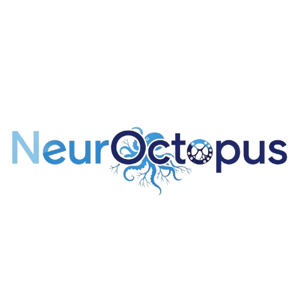

# NeurOctopus – OCR Word Search Solver




## Overview
**NeurOctopus OCR Word Search Solver** is a complete C application that automatically solves word search puzzles from images. The system uses a multi-stage pipeline:

1. **Image Processing & Grid Detection** - Extracts puzzle grid and word list from images
2. **Neural Network OCR** - Recognizes individual letters using a trained neural network
3. **Word Search Solver** - Finds words in all directions (horizontal, vertical, diagonal)
4. **SDL2 GUI Interface** - Interactive visualization with step-by-step processing

The system transforms any word search puzzle image into a solved, highlighted puzzle automatically!

---

## Features

### Image Processing Pipeline
- **Automatic Grid Detection** - Identifies puzzle grid and word list zones
- **Letter Segmentation** - Extracts individual letters for OCR processing
- **Image Preprocessing** - Contrast adjustment, binarization, noise removal
- **Rotation Correction** - Interactive image rotation for better alignment

### Neural Network OCR
- **Trained Model** - 26-letter alphabet recognition with ~95% accuracy
- **Real-time Training** - Continue training the model through the GUI
- **Dataset Support** - Uses custom letter dataset for training

### Word Search Solver
- **8-Direction Search** - Horizontal, vertical, and diagonal word finding
- **Batch Processing** - Solves all words from the puzzle simultaneously
- **Visual Highlighting** - Draws colored rectangles around found words

### Interactive GUI
- **Step-by-Step Processing** - Control each stage of the pipeline
- **Real-time Visualization** - See contours, zones, and extracted letters
- **Rotation Controls** - Adjust image orientation for better detection
- **Save/Load Support** - Process multiple puzzle images

---

## Project Structure
```bash
NeurOctopus/
├── SDL/ # GUI Interface
│ ├── main.c # Main SDL application
│ ├── fonction.h # GUI function declarations
│ ├── menu.c # Interactive menu system
│ ├── image_processing.c # Image processing pipeline
│ └── out/ # Output directories (auto-created)
│    ├── grid/ # Extracted grid letters
│    ├── words/ # Extracted word list letters
│    └── steps/ # Processing step images
├── NeuralNetwork/ # OCR Engine
│ ├── neuralNet.c # Neural network implementation
│ ├── train.c # Training functions
│ ├── identify.c # Letter identification
│ └── trainingData.bin # Trained model weights
├── Image_detection/ # Computer Vision
│ ├── image_processing.c # Image loading/preprocessing
│ ├── contour_detection.c # Letter contour detection
│ ├── grid_detection.c # Grid/zone detection
│ └── image_utils.c # Image manipulation utilities
├── Solver/ # Word Search Solver
│ ├── solver.c # Grid solving algorithm
│ └── solver.h # Solver interface
├── images/ # Sample puzzle images
├── Makefile # Build system
└── README.md # This file
```

---

## System Requirements
- C Compiler (GCC, Clang, or MSVC)
- SDL2 with SDL2_image extension
- Make or CMake for building
- 2GB RAM minimum, 4GB recommended

---

## Installation & Build
1. Clone the Repository
```bash
git clone https://github.com/yourusername/NeurOctopus-OCR-WordSearch.git
cd NeurOctopus-OCR-WordSearch
```
2. Build the Project
```bash
# Using the provided Makefile
make
```
3. Run the Application
```bash
# Start with GUI interface
./programme

# Or process a specific image directly
./programme images/wordsearch_puzzle.png
```

---

## Usage Instructions

### GUI Mode (Recommended)
1. Launch the application: ./programme
2. Load an image: Click "Open" or use Ctrl+O
3. Process the image step-by-step
4. Treat: Apply preprocessing (contrast → binarization)
5. Rotate: Adjust image orientation if needed
6. Grid: Detect grid zones and extract letters
7. IA: Run OCR to recognize letters (creates grid.txt and words.txt)
8. Solve: Find and highlight all words in the puzzle
9. Train: Continue training the neural network (optional)

### Command Line Mode
```bash
# Process an image and save extracted letters
./programme path/to/puzzle_image.png

# The system will create:
# - out/grid/: Extracted grid letters (BMP format)
# - out/words/: Extracted word list letters
# - grid.txt: Recognized grid letters
# - words.txt: Recognized word list
```

---

## Output Files
After processing, the system creates:

### Text Files
`grid.txt` - The recognized letter grid (e.g., 15x15 puzzle)

`words.txt` - The list of words to find in the puzzle

### Image Files
`out/grid/` - Individual letters from the puzzle grid

`out/words/` - Individual letters from the word list

`out/steps/` - Processing step images (for debugging)

`temp_processed.bmp` - Final processed image for display

### Example Output
```text
grid.txt:
ABCDEFGHIJKLMNO
PQRSTUVWXYZABCD
EFGHIJKLMNOPQRS
...

words.txt:
COMPUTER
PROGRAMMING
ALGORITHM
NEURALNETWORK
...
```

---

## Neural Network Training
The included neural network can be improved:

### Training Data Structure
```text
dataset/
├── A/           # Letter A samples
│   ├── A_001.bmp
│   ├── A_002.bmp
│   └── ...
├── B/           # Letter B samples
└── ...
```
### Training Commands
```bash
# Through the GUI: Click "Train" button
# Through command line:
cd NeuralNetwork
./neuralNet --Train    # Start training
./neuralNet --Test     # Test accuracy
./neuralNet --Identify # Process extracted letters
```
### Training Parameters (in variables.h)
```c
#define INPUT_NODES 1024    # 32x32 pixel images
#define HIDDEN_NODES 256    # Hidden layer size
#define OUTPUT_NODES 26     # Letters A-Z
#define LEARNING_RATE 0.01  # Training rate
#define EPOCHS 10000        # Training iterations
```

---

## Common Issues
### "SDL2 not found" during compilation

```bash
# Install SDL2 development libraries
sudo apt-get install libsdl2-dev libsdl2-image-dev
````

### Image won't load

- Supported formats: BMP, PNG, JPG
- Check file path and permissions
- Ensure SDL2_image is installed

### OCR accuracy is low

- Try rotating the image (Rotate button)
- Check image quality (clear, high contrast)
- Retrain the neural network (Train button)

### Words not found in solver

- Verify grid.txt and words.txt exist
- Check OCR accuracy (some letters might be misrecognized)
- Ensure grid dimensions match the image

---

# Happy Puzzle Solving! 🧩🔍
